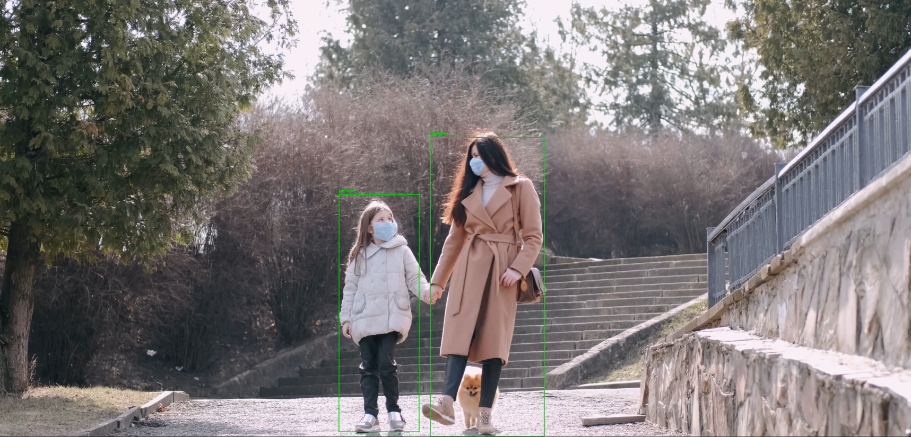

### 🧾 **Part 1: Overview**

This project performs **multi-object tracking** (specifically people) in a video using **YOLOv3** for object detection and **OpenCV trackers** (like CSRT or KCF) for object tracking.
It detects all people in the first frame and then tracks each of them across the video.


---

### ⚙️ **Part 2: Setup and Usage**

#### 1. **Dependencies**

* Python 3.6+
* OpenCV 
* NumPy
* tqdm

Install dependencies via:

```bash
pip install -r requirements.txt
```

#### 2. **Files Needed**

* `input.mp4`: The input video file.
* YOLOv3 files:

  * `yolo/yolov3.cfg`
  * `yolo/yolov3.weights` (download from [YOLO official site](https://pjreddie.com/darknet/yolo/))
  * `yolo/coco.names` (contains class labels)

#### 3. **Run the Script**

```bash
python track.py
```

Output video with tracked people will be saved as `output.mp4`.

---

### 📌 **Part 3: Customization & Notes**

* **Change target class**:
  You can replace `TARGET_CLASS = "person"` with `"car"`, `"dog"`, etc., if needed.

* **First-frame detection**:
  Detection is done **only on the first frame** to initialize trackers. For dynamic detection in all frames, you’ll need to modify the script.

* **Performance tip**:
  CSRT offers higher accuracy but is slower; you can switch to KCF if speed is more important.

